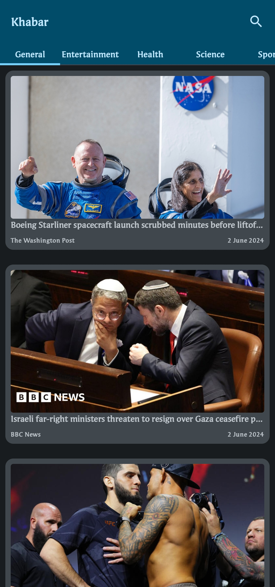
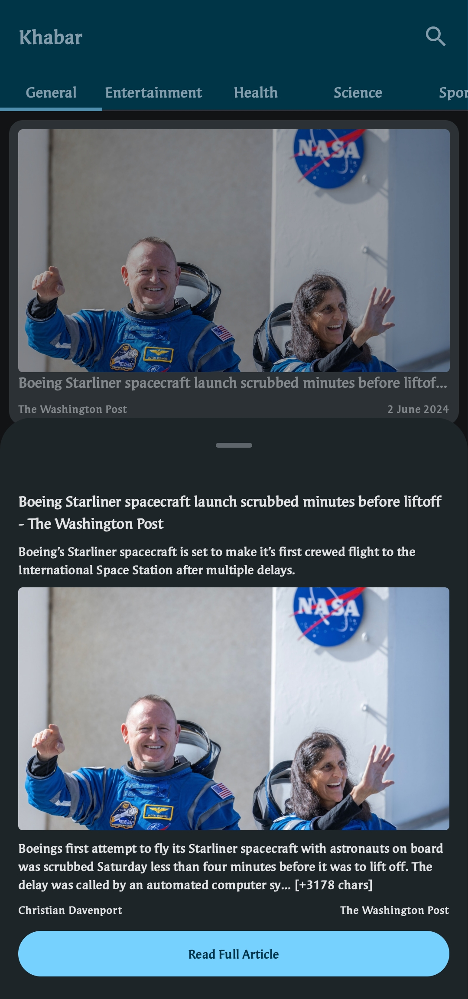
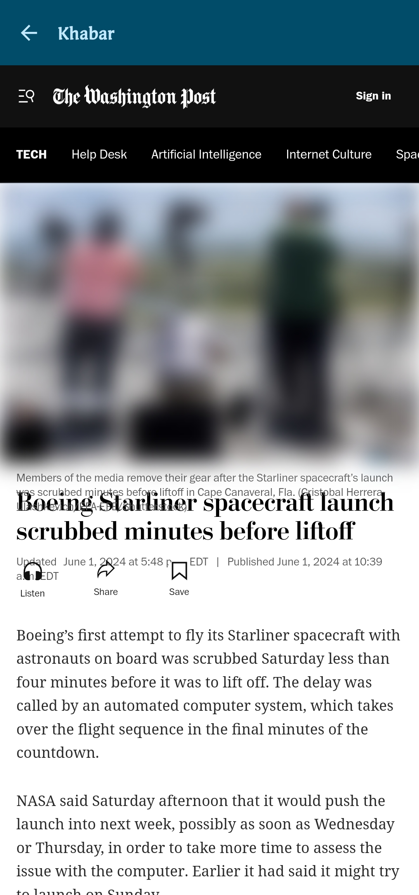

# Khabar News App

Khabar News App is an Android application built using Jetpack Compose, Retrofit, Dagger Hilt, and Coil libraries. It follows the MVVM architecture to provide a robust and maintainable codebase. The app allows users to browse news by category, search for specific news, and read full articles.

## Table of Contents
1. [Features](#features)
2. [Installation](#installation)
3. [Libraries Used](#libraries-used)
4. [How to Open the Project](#how-to-open-the-project)
5. [Screenshots](#screenshots)

## Features

- **News by Category**: Browse news articles based on different categories.
- **Search News**: Search for specific news articles using keywords.
- **Read Full Articles**: Read the full content of news articles.

## Installation

To get a local copy up and running follow these simple steps:

### Prerequisites

- Android Studio
- Git

### Clone the Repository

```bash
git clone https://github.com/toshit-dh/khabar-app.git
```

### Open in Android Studio

1. Open Android Studio.
2. Click on `File` > `Open`.
3. Navigate to the cloned repository directory and select it.
4. Wait for Android Studio to build the project.

### Run the App

1. Connect an Android device or start an emulator.
2. Click on `Run` > `Run 'app'`.

## Libraries Used

- **Jetpack Compose**: For building the UI.
- **Retrofit**: For network calls.
- **Dagger Hilt**: For dependency injection.
- **Coil**: For loading images.
- **MVVM Architecture**: For separating concerns and managing the UI-related data in a lifecycle-conscious way.

## How to Open the Project

1. **Clone the Repository**: Use the `git clone` command to clone the repository to your local machine.
   ```bash
   git clone https://github.com/toshit-dh/khabar-app.git
   ```

2. **Open in Android Studio**: 
   - Open Android Studio.
   - Select `File` > `Open`.
   - Navigate to the directory where you cloned the repository.
   - Select the project directory and click `Open`.

3. **Build the Project**: 
   - Let Android Studio download the required dependencies and build the project.
   - Make sure your environment is properly configured with the required SDK and tools.

4. **Run the App**: 
   - Connect an Android device via USB or start an Android emulator.
   - Click `Run` > `Run 'app'` or press Shift + F10 to run the application.

## Screenshots

  - Home Screen

  - Bottom Sheet

  - Full Article


